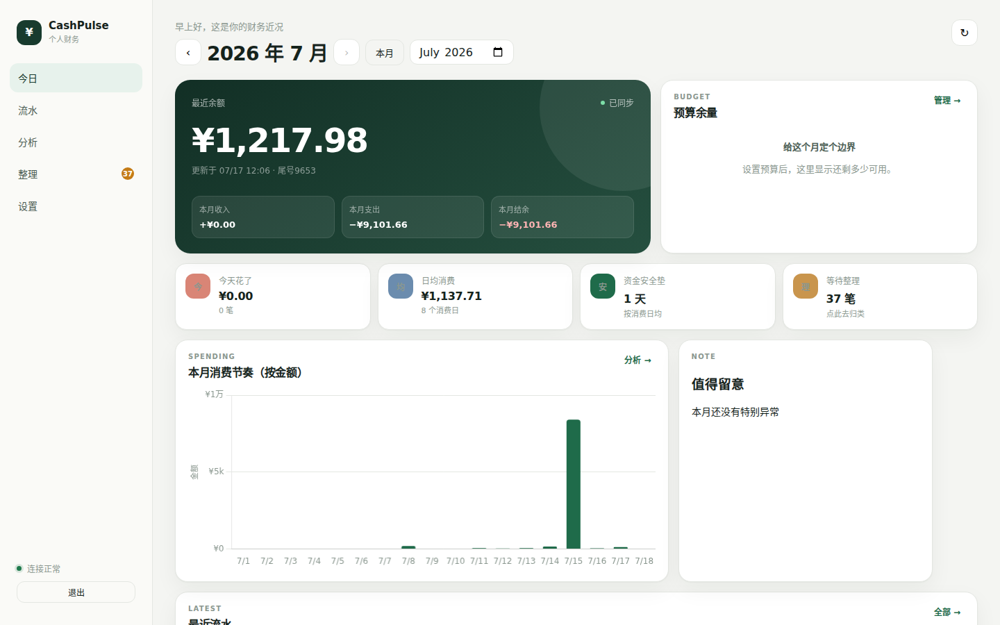
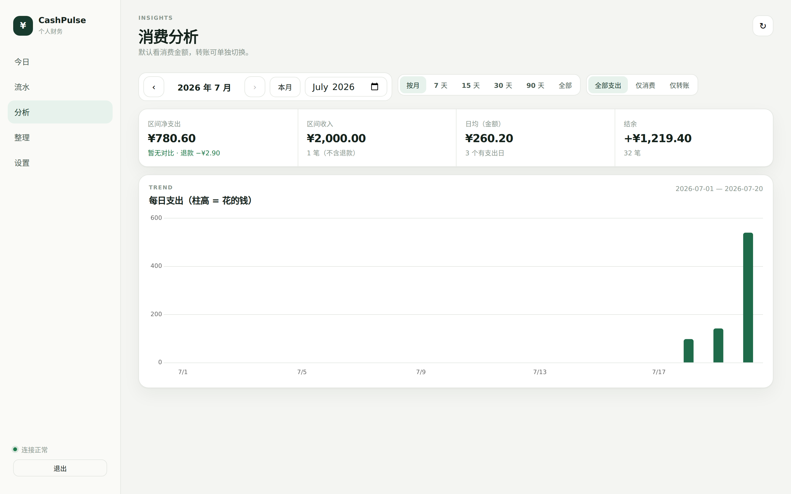
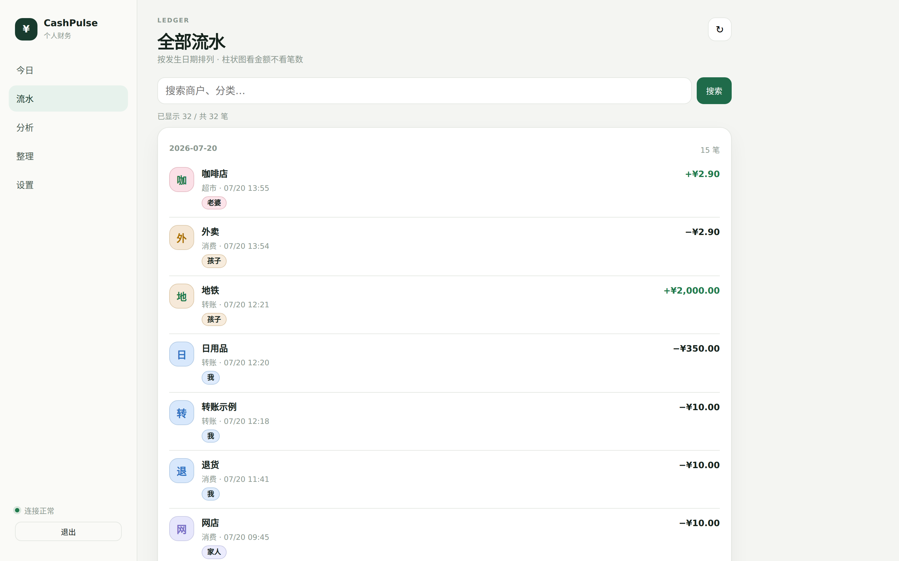
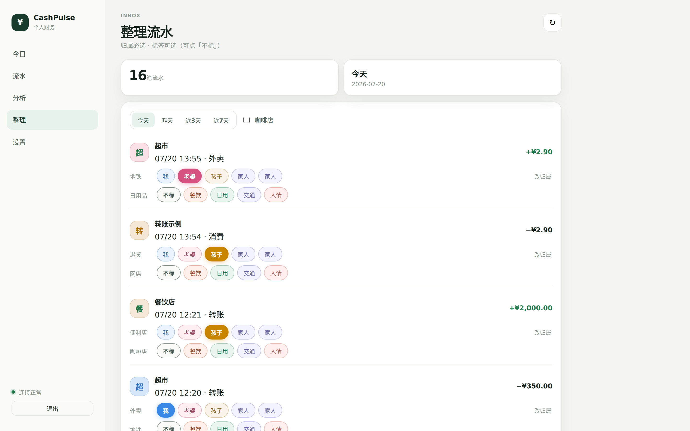
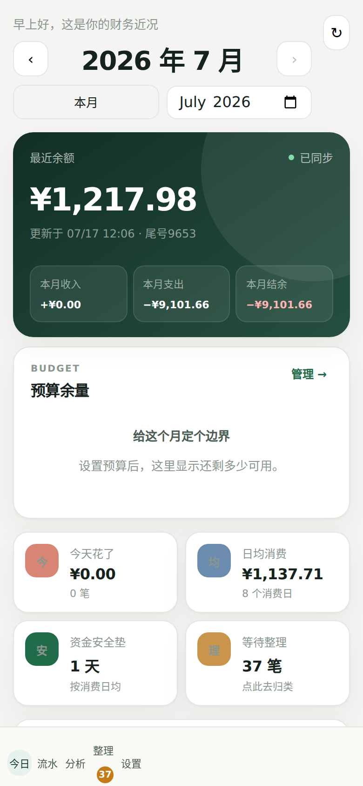

# CashPulse

**用 iPhone 快捷指令，把银行短信变成自己的账本。**

收到银行短信 → 快捷指令自动转发全文 → CashPulse 解析入库 → 手机/电脑打开看板看**花了多少**。  
数据只存在你自己的服务器上，不经过第三方记账 App。

[](LICENSE)
[](https://go.dev/)
[](https://react.dev/)

## 产品定位

CashPulse 是 **个人/家庭自托管的「支出账本」**，不是全能理财中心。

| 主打 | 说明 |
|------|------|
| **看花了多少** | 所有**出去**的钱：消费、转出、手续费、理财划出… |
| **退款特例** | 银行短信里的退货/退款，从支出里冲减，**不算收入** |
| **家庭归属** | 手动标「我 / 老婆 / 孩子」；标签（餐饮等）可选 |
| **隐私** | 数据在自己机器；首页余额默认遮盖，手指划开才看 |

**不深究的：** 工资、大额转入、别人打来的钱——只在结余里带一下，不做渠道拆解。  
**不做的：** 退款自动绑回原消费单、自动打标签、连接银行 API。

适合：**自托管、隐私优先、愿意自己搭一台小服务** 的个人/家庭。

## 记账口径（重要）

时间窗可以是 **本月 / 近 7·15·30·90 天 / 全部**，算法一致：

| 指标 | 算法 |
|------|------|
| **支出（净花费）** | 区间内所有 `direction=out` − 区间内所有退款（`kind=refund`） |
| **收入** | 区间内进账，**不含退款**（工资/转入等） |
| **结余** | 收入 − 净支出 |
| **流水** | 原样保留：消费一行、退款一行，**不删不合并** |

一句话：

> **管「出去」；进账里只特殊处理「退款冲支出」。**

筛选（分析页）：

- **全部支出**（默认）：所有出去的钱 + 退款冲减  
- **仅消费 / 仅转账**：按类型再过滤  

## 界面预览

### 今日（桌面）



余额（可划开查看）、本月收支（支出已扣退款）、预算余量、按金额的支出节奏、最近流水。  
**月份可左右切换**（按月看账）。

### 分析



近 7/15/30/90 天或按月；全部支出 / 仅消费 / 仅转账；渠道构成；「谁花了多少」。

### 流水



按日分组；展示归属人与标签；搜索与加载更多。

### 整理（打标）



**归属必选**，**标签可选**（可点「不标」）。点完归属卡片会暂留，方便继续点标签，再点「完成」收起。

### 手机



底部导航，适配手机浏览与整理。

## 和 iPhone 快捷指令怎么接

> 第一次配置请直接查看：**[iPhone 快捷指令接入教程](docs/iphone-shortcuts.md)**。教程包含 iPhone 上的逐步操作、字段填写、测试方法和常见问题排查。

```text
┌─────────────┐     自动转发全文      ┌──────────────────┐
│ 银行短信     │ ──────────────────► │ 快捷指令          │
│ (如 95580)  │                      │ 当收到短信时…     │
└─────────────┘                      └────────┬─────────┘
                                              │ HTTPS POST
                                              │ Authorization: Bearer <INGEST_TOKEN>
                                              ▼
                                     ┌──────────────────┐
                                     │ CashPulse 服务    │
                                     │ 解析 → SQLite     │
                                     └────────┬─────────┘
                                              │
                         ┌────────────────────┼────────────────────┐
                         ▼                    ▼                    ▼
                      今日看板              分析报表              家庭打标
```

### 快捷指令配置要点

| 项 | 值 |
|----|-----|
| 触发 | 收到短信（可筛选发件人/关键词，如 95580、邮储） |
| 动作 | **获取 URL 内容**（或「URL」+ POST） |
| URL | `https://你的域名/api/v1/sms` |
| 方法 | `POST` |
| 请求头 | `Authorization` = `Bearer <你的 INGEST_TOKEN>` |
| 请求头 | `Content-Type` = `application/json` |
| 请求体 | JSON：`{"text":"短信全文","source":"iphone"}` |

`text` 必须是**完整短信原文**（含【邮储银行】…），不要只截金额。  
Token 放在 **Header**，不要拼在 URL `?token=` 里。

相同短信正文重复提交会去重（重试安全），不会重复计账。

## 功能一览

- 短信入库与幂等（全文指纹，防快捷指令重试重复记账）
- 邮储短信解析：金额 / 收支方向 / 商户归一 / 类型 / 余额 / 时间  
  - 类型含：消费 · 转账 · **退款** · 手续费 · 入账 · 理财…
  - 退货 / 跨行退款 → `kind=refund`，统计时冲减支出
- 今日：余额（划开查看）、当月净支出、预算、支出节奏（柱高=金额）、最近流水
- 分析：按月或 7/15/30/90 天；默认全部支出；谁花了多少
- 整理：归属人 + 可选标签（含「不标」）；入库可配自动规则
- 预算、存钱目标、CSV 导出、银行卡汇总
- 网页：**管理员密码**登录（Session 约 30 天，防爆破锁定）
- 短信上报：**独立 INGEST_TOKEN**（与网页密码分开）
- 单二进制 + 内嵌前端；SQLite；可 Docker / Caddy 部署

## 技术栈

| 层 | 选型 |
|----|------|
| API | Go 1.22+、标准库 `net/http` |
| 存储 | SQLite（`modernc.org/sqlite`） |
| 前端 | Vite + React + Chart.js（构建后 embed 进二进制） |

## 快速开始

```bash
# 一键构建（前端 + 嵌入 + 后端）
make build

# 或分步：
cd web && npm install && npm run build && cd ..
mkdir -p cmd/server/dist && cp -R web/dist/. cmd/server/dist/
go build -o bin/cashpulse ./cmd/server

# 运行（开发示例，务必改成自己的密钥）
export INGEST_TOKEN=dev-ingest
export ADMIN_PASSWORD=dev-password
export PORT=8080
export DATABASE_PATH=./data/cashpulse.db
export TZ_NAME=Asia/Shanghai
./bin/cashpulse
```

浏览器打开 http://127.0.0.1:8080 ，用 `ADMIN_PASSWORD` 登录。

导入历史短信（CSV 只用 **`text` 列**）：

```bash
go run ./cmd/import -file path/to/export.csv -db ./data/cashpulse.db
# 或: make import-sms FILE=path/to/export.csv
```

## 配置

详见 `.env.example` 与 [`deploy/`](deploy/)。

| 变量 | 必填 | 用途 |
|------|------|------|
| `ADMIN_PASSWORD` | **是** | 网页登录密码 |
| `INGEST_TOKEN` | **是** | 仅短信上传（给快捷指令） |
| `ADMIN_TOKEN` | 否 | 可选，脚本调管理 API（网页不用） |
| `DATABASE_PATH` | 否 | SQLite 路径 |
| `PORT` | 否 | 监听端口，默认 `8080` |
| `TZ_NAME` | 否 | 解析/统计/CSV 时区，默认 `Asia/Shanghai` |
| `SECURE_COOKIE` | 否 | 公网 HTTPS 请设 `true` |
| `SESSION_TTL_HOURS` | 否 | 登录保持小时数，默认约 720（30 天） |

兼容：若未设 `INGEST_TOKEN`，可回退使用 `API_TOKEN`。

## 短信接口

```http
POST /api/v1/sms
Authorization: Bearer <INGEST_TOKEN>
Content-Type: application/json

{"text":"【邮储银行】…完整短信…","source":"iphone"}
```

成功：`201`；已处理过的相同正文：`200` 且 `"duplicate": true`，并带回原交易。

## 部署

见 [`deploy/README.md`](deploy/README.md)（Docker、Caddy、systemd 示例）。

开源的是**代码**；你的流水库和密钥只在你自己机器/服务器上，不会随 `git clone` 带走。

## 安全

见 [SECURITY.md](SECURITY.md)。

- 网页密码与短信 Token **分开**
- 登录有防爆破（错误过多会暂时锁定新登录；**已登录会话不受影响**）
- 首页余额默认遮盖，需主动划开查看
- 请勿把真实短信导出、`.env`、数据库提交进 Git

## 当前边界与后续

**已经稳的主路径：** 短信 → 解析 → 按月/区间看净花费 → 家庭打标 → 自托管。

**刻意不做（当前）：**

- 退款与原消费单自动配对  
- 按商户自动打餐饮等标签  
- 多银行深度模板（目前以邮储 95580 为主）  
- 把转入/工资做成分析主角  

欢迎 Issue / PR：更多银行短信模板、解析规则、界面改进。  
请勿提交真实短信原文或生产密钥。

## License

[MIT](LICENSE)
